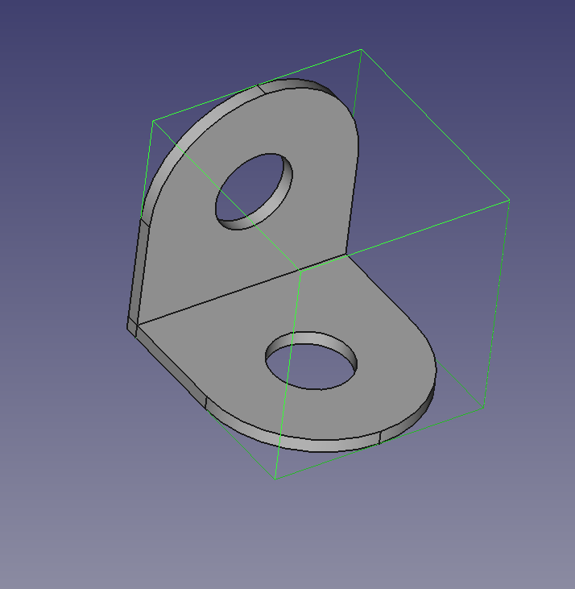
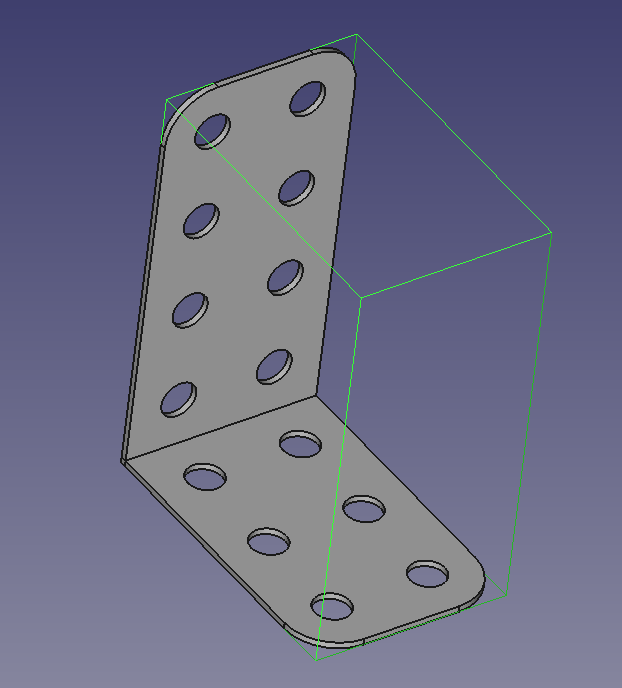
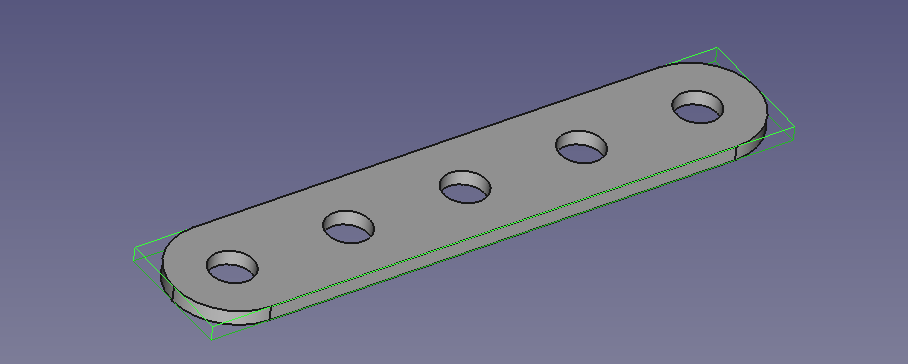
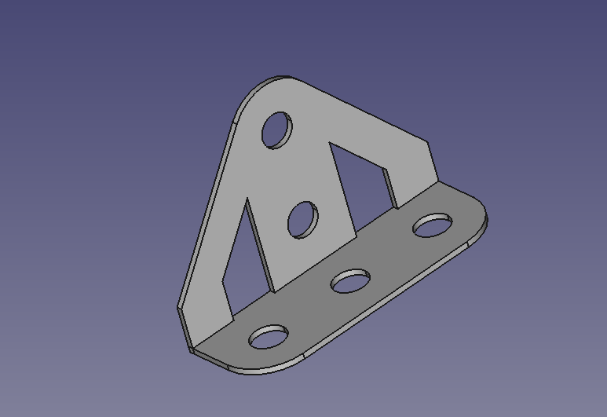
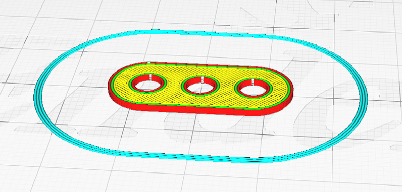

# Meccano

Meccano is a Python library for modeling and programmatically generate mechanical pieces inspired by the Meccano system, such as strips, plates, hinges, and springs. The project provides classes and utilities to create, extrude, and manage geometric and mechanical components programmatically.

Pieces can be exported to STL format for 3D printing or further processing in CAD software. The library is designed to be used with FreeCAD, a powerful open-source parametric 3D CAD modeler.

## Features

- Compatible with FreeCAD 1.0.2
- Define and extrude custom mechanical pieces
- Manage geometries and constraints

## Supported Pieces






## Development in VS Code with Dev Containers

This project includes a pre-configured [devcontainer](https://code.visualstudio.com/docs/devcontainers/containers) for a seamless development experience. To use it:

1. Install [Visual Studio Code](https://code.visualstudio.com/) and the [Dev Containers extension](https://marketplace.visualstudio.com/items?itemName=ms-vscode-remote.remote-containers).
2. Open this project folder in VS Code.
3. When prompted, or via the Command Palette (`F1`), select **"Dev Containers: Reopen in Container"**.
4. VS Code will build and open the workspace inside the container, with all dependencies pre-installed.

You can now run, test, and develop Meccano in a reproducible environment.

## Usage

Import and use the library in your Python scripts:

```python
import FreeCAD as App

from meccano.pieces.l_shaped import Hinge

# create a new FreeCAD document
app = App.newDocument()

# Define a meccano part
hinge= Hinge(n_rows_x=2, n_columns=2, n_rows_z=2).build(app)

doc.saveAs('hinge')
```

## Preparing the part for 3d printing
Parts or assemblies can be exported from FreeCAD in STL format using the mesh workbench, and further processed for 3d-printing. Here you see a screenshot from the CURA software:


## Project Structure

- `meccano/`: Core library
  - `sketch_geometry.py`: Geometry and measurements utilities
  - `pieces/`: Mechanical piece classes (e.g., FlatStrip, Plate, Hinge, Spring)
- `tests/`: Unit tests for the library
- `requirements.txt`: Python dependencies
- `pyproject.toml`: Project metadata

## Testing

Run tests using pytest:
```bash
pytest
```


## License
All code is licensed under the Apache License 2.0. See the LICENSE file for details.